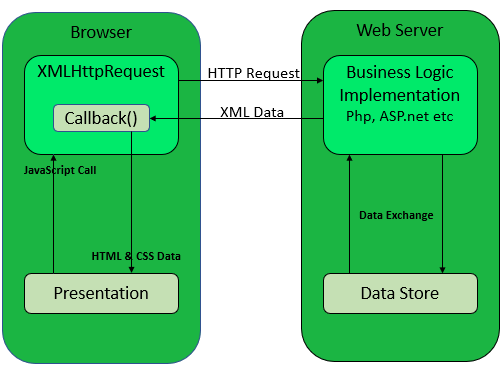

Ajax bir programlama dili değildir. Şu iki şeyi kullanır XMLHttpRequest ve Javascript-HTMl Dom. Veri transferi için XML kullanabilir ama genellikle düz text veya JSON text olarak veri gönderir.

## AJAX'ın Çalışması Mantığı

Tarayıcıda bir işlem yapılır. XMLHttpRequest objesi oluşturulur. İnternet üzerinden HttpRequest sunucuya gönderilir. Sunucuda HttpRequest işlenir. Cevap oluşturulur ve veri tarayıcıya internet üzerinden geri gönderilir. Geri dönen veri, javascript ile işlenir. Sayfanın içeriği güncellenir.

## XMLHttpRequest Objesi

Tüm modern tarayıcılar XMLHttpRequest objesini destekler. XMLHttpRequest objesi, web uygulamasının arka tarafda veri transferi için kullanılabilir. Bu da web sayfasının bazı yerlerini tüm sayfayı yenilemeye gerek kalmadan güncelleyebiliriz demektir.

Get, Post işleminden daha basit ve hızlıdır ama post isteği dosya göndermek, büyük miktarda veri göndermek, kullanıcının girdilerini(şifre gibi)  için daha güçlü ve güvenlidir.

## Jquery ile AJAX Get İşlemi

Jquery'deki *ajax* methodu servera asenkron http isteği atmamızı sağlar. Kullanılışı aşağıdaki şekildedir. GET, POST, PUT, DELETE işlemleri yapılır.

    $.ajax(url,[options]);

Eğer options kısmında method belirtilmez ise default olarak GET isteği atılır.

    $("#myButton").click(function () {
            $.ajax('https://jsonplaceholder.typicode.com/users', {
                type: 'GET',
                dataType: 'JSON',
                success: function (result) {
                    $.each(result, function (index, item) {
                        $("#myList").append('<li>Name: ' + item.name + ' Username: ' + item.username + '</li>');
                    });
                },
                error: function (xhr) {
                    console.log(xhr);
                }
            });
        });

Bir sonraki notum veritabanı bağlantısıyla beraber POST, PUT, DELETE işlemleri olacak.

**Kaynaklar:**

- *<https://www.yogihosting.com/jquery-ajax-aspnet-core/>*

- *<https://www.thereformedprogrammer.net/asp-net-core-razor-pages-how-to-implement-ajax-requests/>*

- *<https://www.w3schools.com/js/js_ajax_intro.asp>*

- *<https://www.tutorialsteacher.com/jquery/jquery-ajax-method>*
